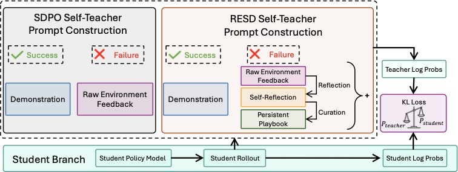
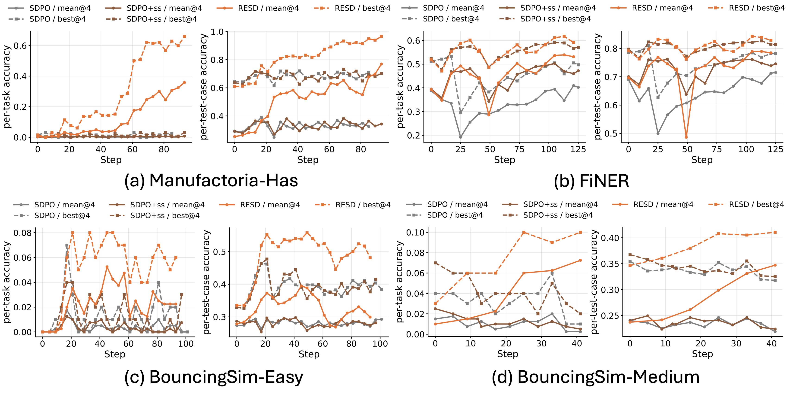
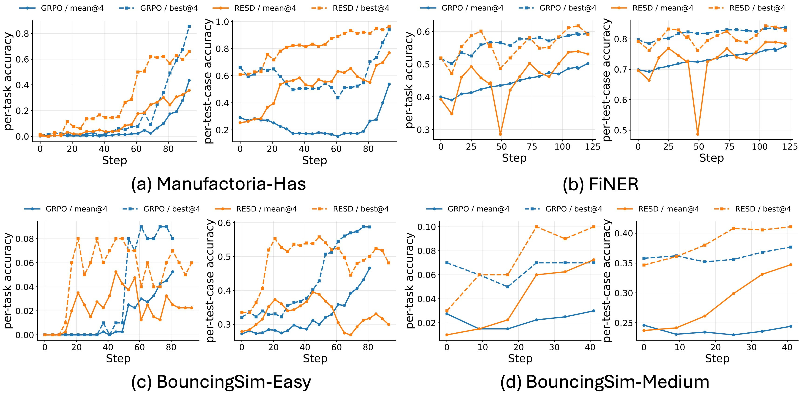

<h1 align="center">RESD</h1>
<p align="center"><em>Learning from Rare Success and Rich Feedback via Reflection-Enhanced Self-Distillation</em></p>

<p align="center">
  <a href="https://yuweizhang.notion.site/resd">
    </a>
  &nbsp;
  <a href="https://github.com/horizon-llm/RESD/blob/resd/paper.pdf">
    </a>
  &nbsp;
  <a href="https://github.com/horizon-llm/RESD">
    </a>
  &nbsp;
  <a href="https://x.com/langfengq/status/1930848580505620677">
    </a>
</p>

`RESD` is an implementation of _on-policy self-distillation_ built on [veRL](https://github.com/volcengine/verl) and [SDPO](https://github.com/lasgroup/SDPO).

Different from original `SDPO`, `RESD` maintains two persistent contexts: **a playbook**, inspired by the broader idea from [ACE](https://arxiv.org/abs/2510.04618), that stores reusable lessons distilled from previous failures, and **an optional solution buffer** that caches successful trajectories when available. At each training step, `RESD` first updates these contexts using the outcome of the current rollout. This is achieved by either removing playbook entries based on their utility and staleness, or adding new entries generated from reflections. Finally, the teacher model is synchronized with the student model via an EMA update and conditioned on the enriched context to produce token-level supervision.

`RESD` allows the model to actively interpret the feedback instead of passively receiving it, which we found to be a key design axis to improve performance.

# News
- [2026.05.12] Code released.

# Framework Comparison
<p align="center">
    
</p>


# Table of Contents

- [Key Features](#key-features)
- [Datasets](#datasets)
- [Results](#results)
- [Installation](#installation)
  - [Install via conda](#install-via-conda)
  - [Docker Environment](#docker-environment)
- [Run Examples](#run-examples)
  - [SDPO](#sdpo)
  - [GRPO](#grpo)
  - [RESD (Ours)](#resd-ours)
- [Run Logs](#run-logs)
- [Acknowledgement](#acknowledgement)
- [Citation](#citation)

# Key Features

- **Fast Playbook Curation & Concise**

  `RESD` reflects on the failed trajectories and curate playbook entries based on the reflections. To ensure a maximum number of entries, the playbook is concised before the curation based on entry utility and staleness. Checkout `selfevolve/resd/context_updater/playbook_context_updater.py`.

- **Interleaved Context Update & Model Update**

  `RESD` supports interleaved context update and model update. At each gradient step, the context is updated based on student rollouts, while model update is conducted afterwards. This design ensures the rollouts are always on-policy.

- **Stream Training**

  `RESD` can be used to perform streaming training where the model makes a single pass over the training data and each training example is seen at most once. For every incoming batch, the trainer executes an inner loop of up to K update iterations on the same set of prompts. Checkout `selfevolve/resd/trainer/ppo/stream_trainer.py`.

- **Customize Feedback Format**

  `RESD` allows to customize the teacher prompt structure. Checkout `selfevolve/resd/context_updater/prompts`.

# Datasets

We evaluate on four tasks spanning program synthesis, physical reasoning, and financial NER. All tasks provide rich execution feedback (e.g., per-test-case pass/fail) despite using sparse binary rewards.

| Task | Source | Train | Test | Description |
|------|--------|------:|-----:|-------------|
| Manufactoria-Has | [RL-Grok](https://github.com/sunblaze-ucb/rl-grok-recipe) | 742 | 132 | Write DSL programs to check input tape patterns |
| BouncingSim-Easy | [RL-Grok](https://github.com/sunblaze-ucb/rl-grok-recipe) | 640 | 100 | Simulate 2-D multi-object bouncing dynamics (easy) |
| BouncingSim-Medium | [RL-Grok](https://github.com/sunblaze-ucb/rl-grok-recipe) | 320 | 100 | Simulate 2-D multi-object bouncing dynamics (medium) |
| FiNER | [ACE](https://github.com/ace-agent/ace) | 1000 | 500 | Tag financial named entities in SEC filings |

**Key characteristics:**
- **RL-Grok tasks** (Manufactoria, BouncingSim): Near-zero initial success rates with per-test-case pass/fail feedback. A natural testbed for learning from failure feedback, requiring the model to synthesize executable programs from scratch.
- **FiNER**: Higher initial success rate with per-entity correctness feedback. Assesses whether RESD benefits regimes where successful demonstrations are more accessible.

# Results
> ⚠️ Note: There might be variations of performance between runs due to rollout quality.

## Comparison with SDPO

<p align="center">
    
</p>

## Comparison with GRPO

<p align="center">
    
</p>

# Installation
You can choose to install from conda env config file or simply pull our pre-built docker image.
## Install via conda
```bash
conda env create -f environment.yml
```

## Docker Environment
```
docker run --gpus all --shm-size=64g --rm -it --net=host \
 --entrypoint /usr/bin/bash \
 brandonzyw/resd:latest
```

# Run Examples
We provide out-of-the-box scripts in the ['RESD/'](selfevolve/resd) directory for training with different settings.

Before running, set your Weights & Biases API key:
```bash
export WANDB_API_KEY=<your-wandb-api-key>
```

## SDPO
```bash
bash selfevolve/resd/run_manufactoria_has_sdpo_stream_qwen3_4b_fsdp.sh # Manufactoria-Has
```
```bash
bash selfevolve/resd/run_finer_sdpo_stream_qwen3_4b_fsdp.sh # FiNER
```
```bash
bash selfevolve/resd/run_bouncingsim_multiobj_easy_sdpo_stream_qwen3_4b_fsdp.sh # BouncingSim-Easy
```
```bash
bash selfevolve/resd/run_bouncingsim_multiobj_medium_sdpo_stream_qwen3_30b_fsdp.sh # BouncingSim-Medium
```

## GRPO
```bash
bash selfevolve/resd/run_manufactoria_has_grpo_stream_qwen3_4b_fsdp.sh # Manufactoria-Has
```
```bash
bash selfevolve/resd/run_finer_grpo_stream_qwen3_4b_fsdp.sh # FiNER
```
```bash
bash selfevolve/resd/run_bouncingsim_multiobj_easy_grpo_stream_qwen3_4b_fsdp.sh # BouncingSim-Easy
```
```bash
bash selfevolve/resd/run_bouncingsim_multiobj_medium_grpo_stream_qwen3_30b_fsdp.sh # BouncingSim-Medium
```

## RESD (Ours)
```bash
bash selfevolve/resd/run_manufactoria_has_resd_stream_qwen3_4b_fsdp.sh # Manufactoria-Has
```
```bash
bash selfevolve/resd/run_finer_resd_stream_qwen3_4b_fsdp.sh # FiNER
```
```bash
bash selfevolve/resd/run_bouncingsim_multiobj_easy_resd_stream_qwen3_4b_fsdp.sh # BouncingSim-Easy
```
```bash
bash selfevolve/resd/run_bouncingsim_multiobj_medium_resd_stream_qwen3_30b_fsdp.sh # BouncingSim-Medium
```

# Run Logs

| Dataset | W&B |
|---------|-----|
| Manufactoria-Has | [](https://api.wandb.ai/links/yuweiz/ff11gsyh) |
| BouncingSim-Easy | [](https://api.wandb.ai/links/yuweiz/ycdeyjra) |
| BouncingSim-Medium | [](https://api.wandb.ai/links/yuweiz/y6s1xz5g) |
| FiNER | [](https://api.wandb.ai/links/yuweiz/6yd1a5k4) |

# Acknowledgement

We gratefully acknowledge the contributions of the [veRL](https://github.com/volcengine/verl) team for providing a solid RL infrastructure.

Special thanks to the [SDPO](https://github.com/lasgroup/SDPO)  and [ACE](https://github.com/ace-agent/ace) project for their codebase, which inspired early design choices during the development of `RESD`.

We also thank the developers of [RL-Grok](https://github.com/sunblaze-ucb/rl-grok-recipe) for providing the data source.

# Citation

If you find `RESD` useful in your research or applications, we would appreciate it if you could cite our work:

```
@misc{zhang2026resd,
  title = {Learning from Rare Success and Rich Feedback via Reflection-Enhanced Self-Distillation},
  url = {https://yuweizhang.notion.site/resd},
  author = {Zhang, Yuwei and Li, Sha and Yu, Changlong and Lu, Qin and Jin, Shuowei and Dong, Chengyu and Liu, Haoran and Ilgee, Hong and Li, Xintong and Shi, Zhenyu and Yin, Bing and Shang, Jingbo},
  journal = {Yuwei Zhang's Notion},
  year = {2026},
  month = may,
}
```

We're excited to share our early results and welcome feedback from the community as we continue to refine and expand RESD’s capabilities. If you have any questions or feedback, please feel free to contact us at [yuz163@ucsd.edu](mailto:yuz163@ucsd.edu).